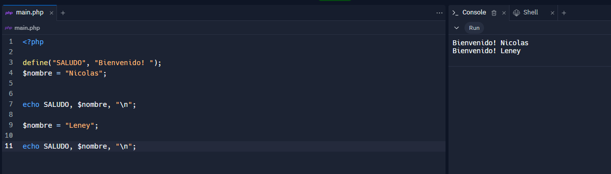
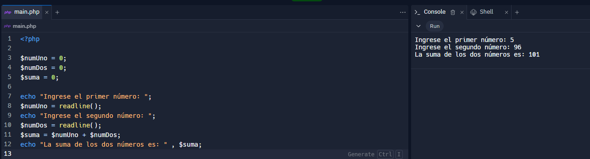
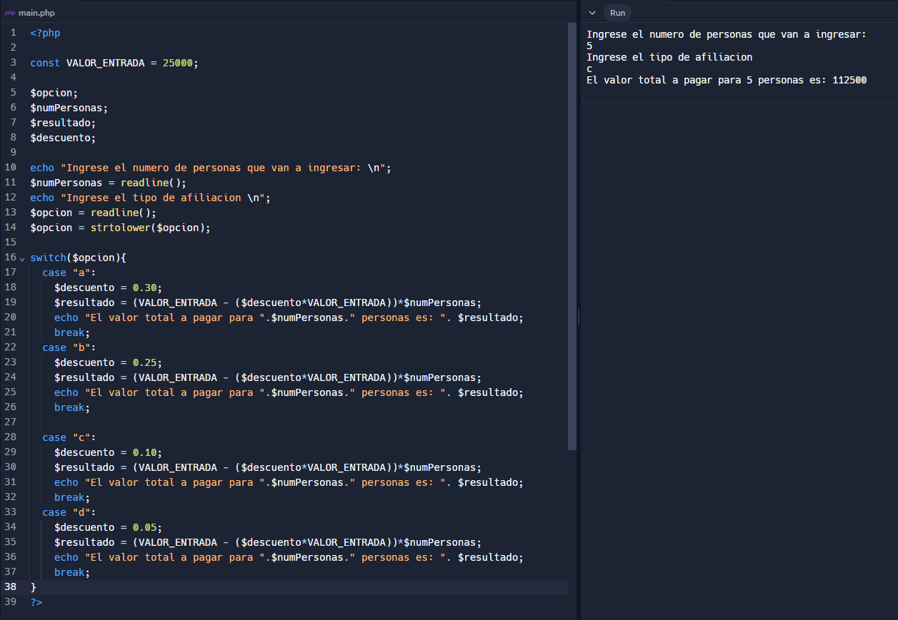

<h1>Taller 10 - NICOLAS RODRIGUEZ</h1>
<h2>Informacion</h2>

Curso: Full stack basico - Grupo 1

Profesor: Cristian Patiño

<h2>Punto 1: Constantes y variables</h2>

<h2>Punto 2: Suma de Constantes y variables</h2>

<h2>Punto 3: Suma de dos numeros indicados por el usuario</h2>

<h2>Punto 4: Datos del usuario en consola</h2>

<h2>Punto 5: Entrada de bolera usando if/else</h2>

<h2>Punto 6: Deteccion de mayoria de edad</h2>

<h2>Punto 7: Seleccion de operacion aritmetica </h2>

<h2>Punto 8: Entrada de bolera usando switch</h2>

<h2>Punto 9: Tabla de multiplicar usando for</h2>

<h2>Punto 10: Numeros pares usando while</h2>

<h2>Punto 11: Numeros impares usando for</h2>

<h2>Punto 12: Tabla de multiplicar usando for</h2>

<h2>Punto 13: Suma de valores de un arregle usando foreach</h2>

<h2>Punto 14: Revision de contraseñas</h2>

<h2>Punto 15: Seleccion de operacion aritmetica usando funciones</h2>

